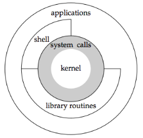

## 引言

从程序员的角度快速浏览 UNIX 及其提供的各项服务，对书中引用的一些术语和概念进行简要说明并给出实例。

## UNIX 体系结构

从严格意义上说，操作系统可被定义为一种控制计算机硬件资源，提供程序运行环境的软件。这种软件因为相对较小且位于环境的核心而通常被称为内核。而从广义上说，操作系统包括内核和一些其他的软件（系统实用软件、应用程序、shell 和公用函数库等）。下面这幅图描述了 UNIX 系统的体系结构。

​					

- 内核的接口被称为系统调用（system calls）。
- 公用函数库建立在系统调用接口之上，而应用程序既可使用公用函数库也可使用系统调用。
- shell 是一种特殊的应用程序，为运行其他应用程序提供了一个接口。

Linux 是 GNU 操作系统使用的内核，一些人将这种操作系统称为 GNU/Linux 操作系统。但是，更常见的叫法是 Linux，显然这种叫法在广义上讲并不正确，而从严格意义上看是可以理解的。

## 登录

### 登录名

用户在登录 UNIX 系统时，需输入登录名与口令，系统在其口令文件中查找比对。口令文件通常为`/usr/passwd`文件，登录项格式为

```
登录名 加密口令 数字用户ID(105) 数字组ID(105) 注释字段 起始目录(/home/sar) shell程序(/bin/ksh)
```

### shell

shell 是一个命令解释器，它读取用户输入，然后执行命令，shell 的用户输入通常来自于终端（交互式 shell），有时则来自于 shell 脚本。

## 文件与目录

### 文件系统

UNIX 文件系统是目录和文件的一种层次结构，所有东西的起点是称为根的目录，其表示为"/"。

目录其实也是一个文件，文件有很多属性，比如文件类型（目录、文件、链接等）、文件大小、文件拥有者、文件权限和文件的修改时间等，可使用 stat 和 fstat 函数查看文件属性。

### 文件名

目录中的各个名字被称为文件名。斜线（/）和空字符不能出现在文件名中，因为斜线用于划分路径，而空字符作为路径名的终结符。为了可移植性，POSIX.1 推荐将文件名限制在以下字符集内：字符（a-z、A-Z）、数字（0-9）、句点（.）、短横线（-）和下划线（_）。

### 路径名

由斜线分隔的一个或多个文件名组成的序列构成路径名，以斜线开头的路径名称为绝对路径名，否则称为相对路径名，相对路径是与当前目录相对的。

### 工作目录

 每个进程都有工作目录，有时称其为当前相对目录（current working directory），所有相对路径都是从根目录开始解释的。一个进程可以使用`chdir`函数改变其工作目录。

### 起始目录

登录时，用户的工作目录设置为起始目录（home directory），该起始目录从口令文件中相应的用户登录项中取得。

## 输入与输出

### 文件描述符

文件描述符通常是一个小的非负整数，内核用以标识一个特定的进程正在访问的 文件，当内核打开一个现有文件或者创建一个新的文件时，它都返回一个文件描述符，在读、写文件时，就可以使用该文件描述符。

### 标准输入、标准输出和标准错误

按惯例，每当运行一个新程序，所有的 shell 窦为其打开 3 个文件描述符，即标准输入（standard input ）、标准输出（standard output）以及标准错误（standard error），如果不做特殊处理，如运行 ls，则这 3 个描述符都指向终端，可使用下面命令将标准输出重定向到某个文件

```shell
ls > file.list
```

### 不带缓冲I/O

 函数 open、read、write、lseek 和 close 提供了不带缓冲的 I/O，这些函数都使用文件描述符。后面再详细讨论。

## 程序与进程

### 程序

程序是一个存储在磁盘上某一个目录中的可执行文件，内核使用 exec 函数将程序读入内存并执行。

### 进程与进程 ID

程序的执行实例被称为进程。UNIX 系统确保每个进程都有一个唯一的非负整数标识符，称为进程 ID。

### 进程控制

有 3 个用于进程控制的主要函数：fork、exec 和 waitpid。

### 线程与线程 ID

一个进程中的所有线程共享同一地址空间、文件描述符、栈及进程相关的属性，因为它们都能访问到同一存储区，所以各线程在访问共享数据时需要采用同步措施以避免不一致性。

线程 ID 只在它所属的进程中起作用，一个进程中的线程 ID 在另一个进程中没有意义。当在一个进程中对某一个特定线程进行处理时则可以使用其线程 ID 引用它。

## 出错处理

当 UNIX 系统函数出错时，通常会返回一个负值，而且负数整型变量 errno 通常被设置为具有特定信息的值，如

-  open 函数如果成功执行则返回一个非负文件描述符，如出错则返回-1，在open 出错时，有大约 15 种 errno 值。
- 大多数返回指向特定对象指针的函数在出错时返回一个 null 指针。

文件`errno.h`中定义了 errno 以及可以赋予它的各种常量这些常量以字符 E 开头。在 Linux 中，出错常量在 [errno(3)](http://man7.org/linux/man-pages/man3/errno.3.html) 手册页中饭列出。

POSIX 和 ISO C 将 errno 定义为一个符号，它扩展成为一个可修改的整型左值（lvalue），它可以是一个包含出错编号的整数，也可以是一个返回出错编号指针的函数，以前使用的定义是：

```c
extern int errno;
```

但在支持多线程的环境中，多个线程共享进程地址空间，每个线程都有属于自己的局部 errno，以避免一个线程干扰另一个线程，例如，Linux 支持多线程存取 errno，将其定义为：

```c
extern int *_ _errno_location(void);
#define errno (*_ _errno_location())
```

对于 errno 应该注意两点：

- 如果没有出错，其值永远不会被例程清除，因此仅当函数的返回值指明出错时，才检验其值。
- 任何函数都不会将 errno 值设置为 0，而且在`<errno.h>`中定义的所有常量都不为 0。

C 标准定义了两个函数，它们用于打印出错信息。

`strerror` 函数将 errno（通常就是 errno 值）映射为一个出错消息字符串，并且返回指向此字符串的指针。

```c
#include <string.h>
/* Returns: pointer to message string */
char *strerror(int errnum);
```

`perror` 函数基于 errno 的当前值，在标准错误上产生一条出错信息，然后返回。它首先输出由 msg 指向的字符串，然后是一个冒号，一个空格，接着是对应于 errno 值的出错信息，最后是一个换行符。

```c
#include <stdio.h>
void perror(const char *msg);
```

下面是这两个出错函数的使用方法

```c
#include "apue.h"
#include <errno.h>

int
main(int argc, char *argv[])
{
      fprintf(stderr, "EACCES: %s\n", strerror(EACCES));
      errno = ENOENT;
      perror(argv[0]);
      exit(0);
}
```

如果将此文件编译为 a.out 文件，然后执行，则

```shell
$ ./a.out
EACCES: Permission denied
./a.out: No such file or directory
```

## 用户标识

### 用户 ID

口令文件登录项中的用户 ID 是一个数值，向系统标识各个不同的用户，通常每个用户有一个唯一的用户 ID。用户 ID 为 0 的用户称为根用户或超级用户（root）。

## 组 ID

口令文件登录项中的组 ID 也是一个数值，它也是由系统管理员指定用户登录名时分配的。用户与组是多对多的关系，组内成员可以共享资源（如文件），可通过设置文件的权限使组内的成员都能访问该文件，而组外成员不能访问。

组文件将组名映射为数值的组 ID，组文件通常为 /etc/group

### 附属组 ID

从 4.2BSD 开始，系统允许一个用户属于多至 16 个其他的组，登录时，读取 /etc/group，寻找则有该用户作为其成员的前 16 个记录项就可得到该用户的附属组 ID。

## 信号

信号用于通知进程发生了某种情况，如某正在除零的进程将收到一个 SIGFPE 信号。进程的三种处理信号方式：

1. 忽略信号
2. 按系统默认方式处理，如对于除零，系统的默认处理方式是终止该进程。
3. 提供一个函数，信号发生时调用该函数，这被称为捕捉该信号。通过提供自编的函数，我们就能知道什么时候产生了信号，并按期望的方式处理它。

## 时间值


## 系统调用与库函数

