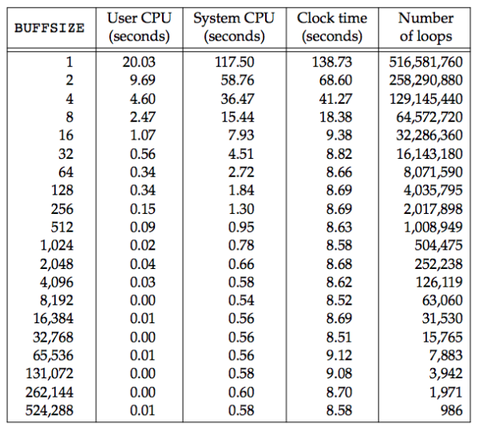
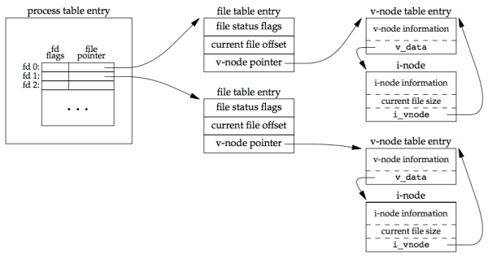

## 描述

本章讨论 unbuffered I/O 相关函数（如 open、read、write、lseek 和 close），unbuffered 指的是每个 read 和 write 都调用内核中的一个系统调用，这些 unbuffered I/O 函数不是 ISO C 的组成部分，但它们是 POSIX.1 和 SUS 的组成部分。

## 文件描述符

- 所有打开的文件都通过文件描述符引用。
- 文件描述符是一个非负整数。
- UNIX 系统 shell 把文件描述符 0 与进程标准输入关联，把 1 与进程的标准输出关联，把 2 与进程的标准错误关联。在符合 POSIX.1 的程序中，这三个描述符可分别被 STDIN_FILENO、STDOUT_FILENO 和 STDERR_FILENO 替换，以提高代码可读性。
- 文件描述符的变化范围是 0 ~ OPEN_MAX - 1，对于 FreeBSD 8.0、Linux 3.2.0,、Mac OS X 10.6.8 和 Solaris 10，文件描述符的变化范围几乎是无限的，它只受系统配置的存储器变量、整数的字长和系统管理员配置的软限制和硬限制约束。

## open 和 openat 函数

调用 open 或 openat 函数可打开或创建一个文件：

```c
#include <fcntl.h>

/* Both return: file descriptor if OK, −1 on error */
int open(const char *path, int oflag, ... /* mode_t mode */ );
int openat(int fd, const char *path, int oflag, ... /* mode_t mode */ );
```

path 参数是要打开或创建的文件名字，oflag 是一个可使用或操作对选项进行组合的参数，必选项有：

- O_RDONLY：只读打开。
- O_WRONLY：只写打开。
- O_RDWR：读、写打开。
- O_EXEC：只执行打开。
- O_SEARCH：只搜索打开，一般用于打开目录时验证其搜索权限。

上面的五个参数必须指定一个且只能指定一个，下面的常量则是可选的：

- O_APPEND：每次写都添加都文件的末端。
- O_CLOEXEC：设置 O_CLOEXEC 为文件描述符标志。
- O_CREAT：若文件不存在就创建它，若使用该参数，open 函数需指定第 4 个参数 mode。
- O_DIRECTORY：如果 path 引用的不是目录，则出错。
- O_EXCL：用于保证测试与创建操作的原子性。
- O_NOCTTY：如果 path 引用的是终端设备，则不讲该设备作为此进程的控制设备。
- O_NOFOLLOW：如果 path 引用的是符号链接，则出错。
- O_NONBLOCK：如果 path 引用的是一个 FIFO、一个块特殊文件或一个字符特殊文件，则此选项为文件的本次打开操作和后续 I/O 操作设置非阻塞方式。这将在 高级/O 中讲述。
- O_SYNC：使每次 write 等待物理 I/O 操作完成，包括由该 write 操作引起的文件属性更新所需的 I/O。
- O_TRUNC：如果此文件存在，而且为只写或读-写成功打开，则将其长度截断为 0。
- O_TTY_INIT：如果打开一个还没打开的终端设备，设置非标准的 terminos，使其符合 SUS。
- O_DSYNC：每次 write 需等待物理 I/O 操作完成，但若该读写操作并不影响读写的数据，则不需等待文件属性被更新。
- O_RSYNC：使每一个以文件描述符作为参数进行的 read 操作等待，直至所有对文件统一部分挂起的写操作都完成。

## creat 函数

可用 creat 来创建一个新文件：

```c
#include <fcntl.h>
/* Returns: file descriptor opened for write-only if OK, −1 on error */
int creat(const char *path, mode_t mode);
```

该函数与下面这样的调用等价

```c
open(path, O_WRONLY | O_CREAT | O_TRUNC, mode);
```

creat 只写，

```c
open(path, O_RDWR | O_CREAT | O_TRUNC, mode);
```

## close 函数

可调用 close 函数关闭一个打开的文件

```c
#include <unistd.h>
/* Returns: 0 if OK, −1 on error */
int close(int fd);
```

当一个进程终止时，内核自动关闭它所有的打开的文件，很多程序利用这一功能而不显式调用 close 关闭打开文件。

## lseek 函数

每个打开的文件都有一个与其关联的 “当前文件偏移量”，它通常是一个非负整数，用来度量从文件开始处计算的字节数。

```c
#include <unistd.h>
/* Returns: new file offset if OK, −1 on error */
off_t lseek(int fd, off_t offset, int whence);
```

对参数 offset 的解释与 whence 有关：

- 若 whence 是 SEEK_SET，则将该文件的偏移量设置为距文件开始处 offset 个字节。
- 若 whence 是 SEEK_CUR，则将该文件的偏移量设置为其当前值加 offset，offset 可正可负。
- 若 whence 是 SEEK_END，则该文件的偏移量为文件长度加 offset，offset 可正可负。

若 lseek 执行成功，则返回新的文件偏移量，所以可用下列方式确定打开文件的当前偏移量：

```c
off_t currpos = lseek(fd, 0, SEEK_CUR);
```

## read 函数

调用 read 函数从打开文件中读数据

```c
#include <unistd.h>
/* Returns: number of bytes read, 0 if end of file, −1 on error */
ssize_t read(int fd, void *buf, size_t nbytes);
```

- `void *` 用于表示通用指针。
- read 函数的返回值必须是一个带符号整数（ssize_t），以保证能返回正整数字节数。
- size_t 是不带符号整数类型。

有多种情况可使实际读到的字节数少于要求读的字节数：

1. 读普通文件时，在读到要求字节数之前已到达了文件末端。
2. 当从终端设备读时，通常一次最多读一行。
3. 当从网络读时，网络中的缓冲机制（如缓冲较小）可能造成返回值小于所要求的字节数。
4. 当从管道或 FIFO 中读而其中包含的字节数少于所需的数量时。
5. 当从某些面向记录设备（record-oriented device，如磁带）读时，一次最多返回一个记录。
6. 当一信号造成中断时，而已经读了部分数据时。

## write 函数

可用 write 函数xaingji打开的文件写数据。

```c
#include <unistd.h>
/* Returns: number of bytes written if OK, −1 on error */
ssize_t write(int fd, const void *buf, size_t nbytes);
```

其返回值通常与参数 nbytes 的值相同，否则表示出错，出错原因有：

- 磁盘已写满。
- 超过了一个给定进程的文件长度限制。

对于普通文件，写操作从文件的当前偏移量处开始。如果在打开文件时，指定了 O_APPEND 选项，则在每次写之前，将文件的偏移量设置在文件的当前结尾处，在一次成功写后，该文件偏移量增加实际写的字节数。

## I/O 效率

下面的程序只使用 read 和 write 函数复制一个文件

```c
#include "apue.h"

#define BUFFSIZE 4096

int
main(void)
{
    int n;
    char buf[BUFFSIZE];

    while ((n = read(STDIN_FILENO, buf, BUFFSIZE)) > 0)
    if (write(STDOUT_FILENO, buf, n) != n)
        err_sys("write error");

    if (n < 0)
        err_sys("read error");

    exit(0);
}
```

关于该程序需注意下面几点：

- 它从标准输入读，写至标准输出，这就假定在执行本程序前，这些标准输入和标准输出在 shell 安排好。
- 考虑到进程终止时，UNIX 系统内核会关闭该进程所有打开的文件描述符，所以此程序并不关闭输入和输出文件。
- 对 UNIX 系统内核而言，文本文件和二进制代码文件并无区别，所以本程序对这两种文件都有效。

下面是使用了不同的 BUFFSIZE 值运行此程序，下图显示了用 20 种不同的缓冲区长度，读 516 581 760 字节的文件所得到的结果。

<div align="center">  </div><br>

用上面的程序读文件，若标准输出被重定向到 /dev/null 上，此测试所用的文件系统是 Linux ext64 文件系统，其磁盘长度为  4,096 字节（磁盘块长度由 st_blksize 表示），这也证明了上图中系统 CPU 时间的几个最小值差不多出现在 BUFFSIZE 为 4,096 及以后的位置，继续增加缓冲区长度对此时间几乎没有影响。

大多数的文件系统为改善性能都采用某种预读（read ahead）技术，当检测到正进行顺序读取时，系统就试图读入比应用程序所要求的更多的数据，并根据程序空间局部性原理，假想程序很快就会读取这些数据，预读的效果可从上图看出，缓冲区长度小至 32 字节时的时钟和时间与拥有较大缓冲区长度时的时间几乎一样。

## 文件共享

UNIX 系统支持在不同进程间共享文件。下图展示了一个进程对应的 3 张表之间的关系，该进程有两个不同的打开文件，一个文件从标准输入打开，另一文件从标准输出打开。

<div align="center">  </div><br>

内核使用 3 种数据结构表示打开文件它们之间的关系决定了在文件共享方面一个进程可能对另一个进程造成的影响。

- 每个进程在进程表中都有一个记录项，其中包含一张打开文件描述符表，可将其视为一个数组，每个描述符占用一项，与每个文件描述符相关联的是：
  - 文件描述符状态（close-on-exec）
  - 指向一个文件表项的指针
- 内核为所有打开文件维护一张文件表，每个表项包含：
  - 文件状态标记（读、写、添写、同步和非阻塞等）
  - 当前文件偏移量
  - 指向该文件的 v 节点表项的指针
- 每个打开的文件都有一个 v 节点（v-node）结构，其中包含文件类型和对此文件进行各种操作函数的指针。
  - 这些信息是在打开文件时从磁盘上读入内存的
  - 对大多数文件，v 节点包含了该文件的 i 节点（i-node，索引节点）
  - Linux 没有使用 v-node，而是使用了通用 i-node 结构，虽然两者实现有异，但实际上都指向了文件系统持有的 i-node 结构。

如果两个独立进程各自打开了同一文件，则有下图的关系：

<div align="center">  </div><br>

两个进程在不同的文件描述符上打开了同一文件，虽然它们都获得了各自的文件表项，但对一个给定的文件只有一个 v-node 表项， **之所以每个进程都获得自己的文件表项，是因为这可以使每个进程都有它自己对该文件的当前偏移量。**

### 具体操作

- 在完成每个 write 后，将文件表项中的当前文件偏移量加上写入的字节数，如果这导致当前文件偏移量超出了当前文件长度，则将 i-node 表项中当前文件的长度设置为当前文件偏移量。
- 如果用 O_APPEND 标志打开一个文件，则相应标志也被设置到文件表项的文件状态标志中，每次对这种具有追加写标志的文件执行写操作时，文件表项中的当前文件偏移量首先会被设置为 i-node 表项中的文件长度，这就使得每次写入的数据都追加到文件的最新尾端。
- 若一个文件用 lseek 定位到文件当前的尾端
  - 文件表项中的当前文件偏移量会被设置为 i-node 表项中的当前文件长度（与用 O_APPEND  情况不同）。
  - lseek 函数值修改文件表项中的当前文件偏移量，不进行任何 I/O 操作。

可能有多个文件描述符都指向同一个文件表项，当使用下面的函数时将看到这种情况：

- dup
- fork：父子进程各自的文件描述符共享同一个文件表项

