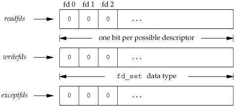

## 描述

讨论非阻塞 I/O、记录锁、I/O 多路复用（select 和 poll 函数、异步 I/O，readv 函数 和 writev 函数以及存储映射 I/O。

## 非阻塞 I/O

非阻塞 I/O 可使 open、read、write 等 I/O 操作避免一直阻塞。如果这种非阻塞 I/O 不能完成，则调用会出错返回，表示该操作如继续执行将阻塞。对一个给定的文件描述符，有两种为其指定非阻塞 I/O 的方式：

1. 如果调用 open 获得文件描述符，则可指定 O_NONBLOCK 标志。
2. 对于已打开的文件，则可调用 fcntl 函数，由该函数打开 O_NONBLOCK 文件状态标志。

## 记录锁

当一个进程正在读或修改文件的某个部分时，使用记录锁可阻止其他进程修改同一文件区域，因为 UNIX 系统内核没有 “记录” 这一概念，而这种锁锁定的只是文件的某一个区域，所以其实 “记录锁” 被叫做 “字节范围锁（byte-range locking）” 更为贴切。

## I/O 多路转换

异步 I/O：进程通知内核：当描述符准备好可以进行 I/O 时，用一个信号通知它。


### select 函数

所有 POSIX 兼容的平台都支持使用 select 函数进行 I/O 多路转换，传给 select 函数的参数会告诉内核：

- 所关心的文件描述符
- 对每个描述符，我们所关心的状态。(我们是要想从一个文件描述符中读或者写，还是关注一个描述符中是否出现异常)
- 我们要等待多长时间。(我们可以等待无限长的时间，等待固定的一段时间，或者根本就不等待)

从 select 函数返回后，内核告诉我们一下信息：

- 对我们的要求已经做好准备的描述符的个数
- 对于三种条件哪些描述符已经做好准备.(读，写，异常)

有了这些返回信息，我们可以调用合适的 I/O 函数（通常是 read 或 write），并且这些函数不会再阻塞。先看看函数原型：

```c
#include <sys/select.h>

/* Check the first NFDS descriptors each in READFDS (if not NULL) for read
   readiness, in WRITEFDS (if not NULL) for write readiness, and in EXCEPTFDS
   (if not NULL) for exceptional conditions.  If TIMEOUT is not NULL, time out
   after waiting the interval specified therein.  Returns the number of ready
   descriptors, or -1 for errors.

   This function is a cancellation point and therefore not marked with
   __THROW.  
   若有就绪描述符，则返回就绪描述符数目；若超时则返回 0，出错返回 -1 */
int select (int maxfd, 
            fd_set * readfds,
		    fd_set * writefds,
		    fd_set * exceptfds,
		    const struct timeval * timeout);
```

#### maxfd

select 函数的第一个参数 maxfd 监视对象文件描述符的数量，一般为最大的文件描述符编号加 1，

#### fd_set

中间的三个参数 readfds、writefds、exceptfds 是指向 fd_set 的结构体指针，它们说明了我们关心的变成可读、可写或处于异常条件的描述符集合，先看看 fd_set 结构体：

```c
/* The fd_set member is required to be an array of longs.  */
typedef long int __fd_mask;
#define __NFDBITS	(8 * (int) sizeof (__fd_mask))

/* fd_set for select and pselect.  */
typedef struct
  {
    /* XPG4.2 requires this member name.  Otherwise avoid the name
       from the global namespace.  */
#ifdef __USE_XOPEN
    __fd_mask fds_bits[__FD_SETSIZE / __NFDBITS];
# define __FDS_BITS(set) ((set)->fds_bits)
#else
    __fd_mask __fds_bits[__FD_SETSIZE / __NFDBITS];
# define __FDS_BITS(set) ((set)->__fds_bits)
#endif
  } fd_set;
```

说到底就是设置了一个 long int 类型的数组，其中存储的是文件描述符，我们可以先简单地认为它是一个 0/1 组成的比特数组。



对于

为了方便操作该数组，在 sys/select.h 中定义了下面这一组宏用来控制 fd_set 集合：

```c
// 用于在集合中设置参数 fd 传递的文件描述符
void FD_SET(int fd, fd_set fdset);
// 用于在集合中清除参数 fd 传递的文件描述符
void FD_CLR(int fd, fd_set fdset);
// 当 fd 指向的文件描述符是由 fdset 指向的 fd_set 中的一个元素时返回非零值
int FD_ISSET(int fd, fd_set fdset);
// 将一个 fd_set 中的数组元素都设为 0
void FD_ZERO(fd_set fdset);
```

在声明一个 fd_set  后，必须用 FD_ZERO 将这个文件描述符置为 0，然后在其中设置我们关心的各个描述符的位，具体操作如下：

```c
fd_set   rset;
int      fd;
FD_ZERO(&rset);
FD_SET(fd, &rset);
FD_SET(STDIN_FILENO, &rset);
```

从 select 函数返回后，可用 FD_ISSET 测试该集中的一个给定位是否仍处于打开

```c
if (FD_ISSET(fd, &rset)) {
    ...
}
```

#### readfds

将所有关注“是否存在待读取数据”的文件描述符注册到 fd_set 型变量，并传递其地址值，即要监视 readfds 中的文件描述符的读变化，即关心是否可以从这些文件中读取数据了，如果该集合中有一个文件可读，select 就会返回一个大于 0 的值，表示有文件可读；如果没有可读的文件，则根据 timeout 参数再判断是否超时，若超出 timeout 的时间，select 返回0，若发生错误返回负值。可以传入 NULL 值，表示不关心任何文件的读变化。

#### writefds

将所有关注“是否可传输无阻塞数据”的文件描述符注册到 fd_set 型变量，并传递其地址值，即要监视这些文件描述符的写变化，关心是否可以向这些文件中写入数据了，如果该集合中有一个文件可写，select 就会返回一个大于 0 的值，表示有文件可写，如果没有可写的文件，则根据 timeout 参数再判断是否超时，若超出 timeout 的时间，select 返回 0，若发生错误返回负值。可以传入 NULL 值，表示不关心任何文件的写变化。

#### exceptfds

同上面两个参数的意图，用来监视发生异常的文件。

#### timeout

用于指定 select 函数愿意等待的时间长度，单位为秒和毫秒，timeval 结构如下所示

```c
#include <sys/time.h>   
/* A time value that is accurate to the nearest
   microsecond but also has a range of years.  */
struct timeval
{
    time_t tv_sec;		/* Seconds.  */
   	long tv_usec;		/* Microseconds.  */
};
```

有三种情况：

- **timeout == NULL：** 无限等待，期间可捕获中断信号。当有一个描述符 I/O 就绪或者捕获到一个信号时返回。如果捕获到一个信号， select 函数将返回 -1，并将变量 errno 设为 EINTR。
- **timeout->tv_sec == 0 && timeout->tv_usec == 0：** 不等待，直接返回。加入描述符集的所有描述符都会被测试，并且返回满足要求的描述符的个数。这种方法通过轮询，无阻塞地获得了多个文件描述符状态。
- **timeout->tv_sec != 0 ||timeout->tv_usec != 0：** 等待指定的时间。当有描述符符合条件或超过超时时间时返回。当超时时间即将用完但又没有描述符合条件时返回 0。对于第一种情况，等待也会被信号所中断。

### pselect 函数

POSIX.1 中定义了一个 select 函数的变体，称为 pselect

```c
#include <sys/select.h>

// Returns: count of ready descriptors, 0 on timeout, 1 on error
int pselect(int maxfdp1, 
            fd_set *restrict readfds,
            fd_set *restrict writefds, 
            fd_set *restrict exceptfds,
            const struct timespec *restrict tsptr,
            const sigset_t *restrict sigmask);
```

除了下面几点外，pselect 和 select 函数相同

- select 的超时值使用 timeval 结构指定，但 pselect 使用 timespec 结构。timespec 结构以秒和纳秒表示超时值，而非秒和微妙，在平台支持的情况下，timespec 能提供更精确的超时时间。
- pselect 可使用可选信号屏蔽字，若 sigmask 为 NULL，则在与信号有关的方面，pselect 和 select 的运行情况一致。否则， sigmask 指向一个信号屏蔽字，在调用 pselect  时，以原子方式安装信号屏蔽字，在返回时，恢复以前的信号屏蔽字。

### poll 函数

poll 函数类似于 select 函数，但程序接口存在差异。

```c
#include <poll.h>

// Returns: count of ready descriptors, 0 on timeout, 1 on error
int poll(struct pollfd fdarray[], 
         nfds_t nfds, 
         int timeout);
```

与 select 不同，poll 不是为每个条件（可读、可写和异常条件）构造一个描述符集，而是构造一个 pollfd 结构数组，每个数组元素指定一个描述符编号及我们对该描述符感兴趣的条件。

```c
struct pollfd {
    int   fd;       /* file descriptor to check, or <0 to ignore */
    short events;   /* events of interest on fd */
    short revents;  /* events that occurred on fd */
};
```

fdarray 中的元素数由 nfds 指定，由于历史原因，如何声明 nfds 取决于具体的的 UNIX 实现，如：

- SVR3 将 nfds 类型指定为 unsigned long
- SVR4 的 nfds 类型为 size_t
- SUS 则定义了新类型 nfds _t

应将数组元素的 events 成员设置为下表所示值的一个或几个，通过这些值告诉内核我们关心的是每个描述符的哪些条件，返回时，revents 成员由内核设置，用于说明每个描述符发生了哪些条件。需要注意的是，与 select 直接修改入参 fd_set 不同，poll 没有修改 events  成员。

| Name         | Input to `events`? | Result from `revents`? | Description                                                  |
| ------------ | ------------------ | ---------------------- | ------------------------------------------------------------ |
| `POLLIN`     | •                  | •                      | 可不阻塞地读高优先级数据意外的数据，等效于 `POLLRDNORM|POLLRDBAND` |
| `POLLRDNORM` | •                  | •                      | 可不阻塞地读普通数据                                         |
| `POLLRDBAND` | •                  | •                      | 可不阻塞地读优先级数据                                       |
| `POLLPRI`    | •                  | •                      | 可不阻塞地读高优先级数据                                     |
| `POLLOUT`    | •                  | •                      | 可不阻塞写普通数据                                           |
| `POLLWRNORM` | •                  | •                      | 与`POLLOUT`一样                                              |
| `POLLWRBAND` | •                  | •                      | 可不阻塞地写优先级数据                                       |
| `POLLERR`    |                    | •                      | 已出错                                                       |
| `POLLHUP`    |                    | •                      | A hangup has occurred.                                       |
| `POLLNVAL`   |                    | •                      | 描述符没有引用指向一个打开的文件                             |

上表的前 4 行测试的是可读性，接下来的 3 行测试的可写性，最后 3 行是由内核在返回时设置的，即使在 events 字段中没有指定这 3 个值，如果相应的条件发生，在 revents 中也会返回它们。

当一个描述符被挂断（POLLHUP）后，就不能再写该描述符，但仍有可能从该描述符读到数据。

poll 的最后一个参数指定我们愿意等待的时间，与 select 一样，有 3 种情况：

- **timeout == -1：** 永远等待，当所指定的描述符中的一个已准备好，或捕捉到一个信号时返回。若捕捉到一个信号则返回 -1，errno 设置为 EINTR。
- **timeout == 0：** 不等待，测试所有描述符并立即返回，轮询，不阻塞。
- **timeout > 0：** 等待 timeout 毫秒，当指定描述符之一就绪或 timeout 到期时立即返回。若 timeout 到期时还没有一个描述符就绪则返回 0。

## 异步 I/O

使用 select 和 poll 可实现异步形式的通知，但这些函数返回时系统不会告诉我们任何信息。我们需要自己去查询（如遍历 fd_set）。

信号机制提供了一种异步形式 I/O，使用一个信号通知进程，对某个描述符所关心的某个事件已经发生。但这种机制存在一些缺点：

- 不能用于所有的文件类型上
- 只能使用一个信号，如果要对一个以上的描述符进行异步 I/O，那么在进程街道该信号时分不清这一信号对应于哪一描述符。


