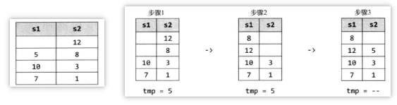

## 包含 min 函数的栈

**题目描述：** 定义栈的数据结构，请在该类型中实现一个能够得到栈中所含最小元素的min函数，要求其时间复杂度应为 O(1)。

**解法1：** 每个栈结点需维护一个 min 属性， 每次人栈时，都将待入栈的结点 node 与栈顶结点的最小值属性进行比较，将其中较小者更新到 node  的最小值属性中。

```java
1. push(5);		// min = 5，栈：[5]	
2. push(6);		// min = 5，栈：[6, 5]
3. push(3);		// min = 3，栈：[3, 6, 5]
4. push(7);		// min = 3，栈：[7, 3, 6, 5]
5. pop();		// min = 3，栈：[3, 6, 5]
6. pop();		// min = 5，栈：[6, 5]
```

可见在状态 5 时，最小值也回到了之前状态 3。

```java
public class StackWithMin extends Stack<NodeWithMin> {
    // 每次入栈都比较入栈元素与原栈顶结点的 min
    // 将较小那个更新到新栈顶的 min
    public void push(int val) {
        int newMIn = Math.min(val, min());
        super.push(new NodeWithMin(val, newMIn));
    }

    public NodeWithMin pop() {
        return super.pop();
    }

    public NodeWithMin top(){
        return super.peek();
    }

    public int min() {
        if (this.isEmpty()) {
            return Integer.MAX_VALUE;
        } else {
            return peek().min;
        }
    }
}

class NodeWithMin {
    int val, min;

    public NodeWithMin(int val, int min) {
        this.val = val;
        this.min = min;
    }
}
```

**解法2：** 解法 1 有个缺点，当栈数据很多时。每个结点都要维护一个 min 属性，就会浪费大量空间，为此可以使用一个辅助栈专门记录最小值。

```java
public class StackWithMin extends Stack<Integer> {
    private Stack<Integer> auxStack;

    public StackWithMin() {
        auxStack = new Stack<>();
    }

    // 当入栈元素比辅助栈的栈顶元素更小
    // 将之压入辅助栈，
    // 注意此时有两份数据在不同的栈
    public void push(int val) {
        if (val <= min()) {
            auxStack.push(val);
        }
        super.push(val);
    }

    // 弹出数据栈栈顶元素时，
    // 判断其是不是与辅助栈的数据一致
    // 是的话说明是一个最小值，需将之同步弹出
    public Integer pop() {
        int val = super.pop();
        if (val == min()) {
            auxStack.pop();
        }
        return val;
    }

    public int min() {
        // 初始时栈空
        if (auxStack.isEmpty())
            return Integer.MAX_VALUE;
        else
            return auxStack.peek();
    }
}
```

## 集合栈

**题目描述：** 请实现一种数据结构 SetOfStacks，由多个栈组成，其中每个栈的大小为 size，当前一个栈填满时，新建一个栈。该数据结构应支持与普通栈相同的 push 和 pop 操作。

**解法：** 向集合栈中压入元素时要对数组的最后一个栈调用 push，不过如果最后一个栈满，就需要新建一个栈。

首先看自定义的栈结构，其中属性有：

- capacity：表示栈的规定大小。
- Node top, button：Node 是栈结点结构，每个结点存有指向其上下结点的指针。
- size：当前栈中的结点数。

```java
class MyStack {
    private int capacity;
    public Node top, button;
    public int size;

    public static class Node {
        int val;
        Node above, below;

        public Node() {}

        public Node(int val) {
            this.val = val;
        }
    }

    public MyStack(int capacity) {
        this.capacity = capacity;
    }

    public boolean isFull() {
        return capacity == size;
    }

    public void join(Node above, Node below) {
        if (below != null)  below.above = above;
        if (above != null)  above.below = below;
    }

    public boolean push(int v) {
        if (size >= capacity)   return false;
        size++;
        Node n = new Node(v);
        if (size == 1)  button = n;
        join(n, top);
        top = n;
        return true;
    }

    public int pop() {
        Node t = top;
        top = top.below;
        size--;
        return t.val;
    }

    public boolean isEmpty() {
        return size == 0;
    }

    public int removeButton() {
        Node b = button;
        button = button.above;
        if (button != null) button.below = null;
        size--;
        return b.val;
    }
}
```

再来看 SetOfStacks 结构，先介绍下成员：

- stacks：栈集合
- capacity：每个栈的容量
- getLastStack：获取最后一个栈
- push：先获取最后一个栈，如果为空，说明第一次插入元素，需新建一个栈插入 stacks 尾部，同样如果最后一个栈已满，也需新建一个栈插入 stacks 尾部，否则直接获取最后一个栈并向其中压入元素。
- pop：先获取最后一个栈，如果最后一个栈为空，则返回 Integer.MIN_VALUE 作为错误码，否则直接在最后一个栈中弹出顶部元素，如果此后栈为空，则将该栈删除。

```java
public class SetOfStacks {
    ArrayList<MyStack> stacks = new ArrayList<>();
    private int capacity;

    public SetOfStacks() {}

    public SetOfStacks(int capacity) {
        this.capacity = capacity;
    }

    public MyStack getLastStack() {
        if (stacks.size() == 0)  return null;
        return stacks.get(stacks.size() - 1);
    }

    private void push(int v) {
        MyStack last = getLastStack();
        if (last != null && !last.isFull()) {
            last.push(v);
        } else {
            MyStack stack = new MyStack(capacity);
            stack.push(v);
            stacks.add(stack);
        }
    }

    private int pop() {
        MyStack last = getLastStack();
        if (last == null)   return Integer.MIN_VALUE;
        int v = last.pop();
        if (last.size == 0)
            stacks.remove(stacks.size() - 1);
        return v;
    }
}
```

##双栈排序

**题目描述：** 请编写一个程序，按升序对栈进行排序（即最大元素位于栈顶），要求最多只能使用一个额外的栈存放临时数据，但不得将元素复制到别的数据结构中。

**解法：** 若要对 s1 排序，只需从 s1 逐一弹出元素，然后按顺序插入 s2 中。



- 从 s1 弹出 5，需将之插到 s2 中的 3 和 8 之间，先把它存放到一个临时变量中。
- 将 12 从 s2 中弹出

```java
public Stack<Integer> sort(Stack<Integer> s){
    Stack<Integer> r = new Stack<>();
    while (!s.isEmpty()) {
        int tmp = s.pop();
        while (!r.isEmpty() && r.peek() > tmp) {
            s.push(r.pop());
        }
        r.push(tmp);
    }
    return r;
}
```

## 猫狗收容所

**题目描述：** 有家动物收容所只收留猫和狗，但有特殊的收养规则，收养人有两种收养方式，第一种为直接收养所有动物中最早进入收容所的，第二种为选择收养的动物类型（猫或狗），并收养该种动物中最早进入收容所的。

**解法：** 为狗和猫各自创建一个队列，然后将两者放进名为 AnimalQueue 的包裹类，并存储某种形式的时间戳，以标记每只动物进入队列（即收容所）的时间。当调用 dequeueAny 时，查看狗队列和猫队列的首部，并返回其中最老那只。先看动物类型：

```java
abstract class Animal {
    private int order;
    protected int id;

    public Animal(int id) {
        this.id = id;
    }

    public int getOrder() {
        return order;
    }

    public void setOrder(int order) {
        this.order = order;
    }

    public boolean isOlderThan(Animal a) {
        return this.order < a.getOrder();
    }
}

class Dog extends Animal{
    public Dog(int id) {
        super(id);
    }
}

class Cat extends Animal {
    public Cat(int id) {
        super(id);
    }
}
```

再看收容所数据结构

```java
class AnimalQueue {
    LinkedList<Dog> dogs = new LinkedList<>();
    LinkedList<Cat> cats = new LinkedList<>();
    
    private int order;

    public void enQueue(Animal a) {
        a.setOrder(order++);
        if (a instanceof Dog)   dogs.add((Dog) a);
        else if (a instanceof Cat)  cats.add((Cat) a);
    }

    public Animal dequeueAny() {
        if (dogs.size() == 0)
            return dequeueCats();
        else if (cats.size() == 0)
            return dequeueDogs();

        Dog dog = dogs.peek();
        Cat cat = cats.peek();

        if (dog != null && dog.isOlderThan(cat))
            return dequeueDogs();
        else return dequeueCats();
    }

    public Cat dequeueCats() {
        return cats.poll();
    }

    public Dog dequeueDogs() {
        return dogs.poll();
    }
}
```

