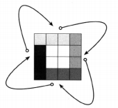

## 确定字符相异

**题目描述：** 实现一个算法，确定一个字符串的所有字符是否全都不同。这里我们要求不允许使用额外的存储结构。

给定一个字符串，请返回一个布尔值，true 代表所有字符全都不同。false 代表存在相同的字符。保证字符串中的字符为 ASCII 字符。字符串的长度小于等于3000。

**解法1：** 若字符集是 ASCII，则字符相异的字符串的长度不会超过 256，否则直接返回 false，利用 bitmap 的思想，创建一个长度为 256 的布尔数组，记录每个字符出现的情况，如果发现又出现超过一次的字符则返回 false。

```java
// 时间复杂度：O(n)，空间复杂度：O(1)
public static boolean isUniqueChars(String str) {
    if (str.length() > 256)    return false;

    boolean[] charSet = new boolean[256];
    for(int i = 0; i < str.length(); i++) {
        int val = str.charAt(i);
        if (charSet[val])     return false;
        charSet[val] = true;
    }
    return true;
}
```

**解法2：** 如果字符串中只含有小写字母，则只有26种情况，这时可使用位向量（bit vector），即设置一个 int 变量，因为在Java中 int 型变量占 32 位，当某个字符出现时，通过位操作将相应的位置 1 即可。

```java
public static boolean isUniqueChars(String str) {
    if (str.length() > 256)    return false;

    int checker = 0;
    for(int i = 0; i < str.length(); i++) {
        int val = str.charAt(i) - 'a';
        if ((checker & (1 << val)) > 0) {
            return false;
        }
        checker |= (1 << val);
    }
    return true;
}
```

## 确定两串乱序同构

**题目描述：** 给定两个字符串，请编写程序，确定其中一个字符串的字符重新排列后，能否变成另一个字符串。这里规定大小写为不同字符，且考虑字符串中的空格。

**解法1：排序字符串** 

如果两串乱序同构，那么它们拥有同一组字符，只不过顺序不同。因此，对字符串排序，将得到相同的字符序列。

```java
public boolean permutation(String s, String t) {
    if (s.length() != t.length())   return false;
    char[] c1 = s.toCharArray();
    char[] c2 = t.toCharArray();
    Arrays.sort(c1);
    Arrays.sort(c2);
    return Arrays.equals(c1, c2);
}
```

**解法1：检查各字符是否数是否一样** 

假设字符集是 ASCII，则同样可以设置一个长度为 256 的计数数组来记录两个字符串中每个字符出现的次数，如果所有字符的出现次数一致，则返回 true。

```java
public boolean permutation(String stringA, String stringB) {
    if (stringA.length() != stringB.length())   return false;
    int[] letters = new int[256];
    for (int i = 0; i < stringA.length(); i++) {
        letters[stringA.charAt(i)]++;
    }
    for (int i = 0; i < stringB.length(); i++) {
        if (--letters[stringB.charAt(i)] < 0)
            return false;
    }
    return true;
}
```

## 空格替换

**题目描述：** 请编写一个方法，将字符串中的空格全部替换为“%20”。假定知道字符串的真实长度(小于等于1000)，同时保证字符串由大小写的英文字母组成。

**解法：** 进行两次扫描，第一次先扫出字符串中有多少空格，从而确定最终的字符串长度。第二次扫描开始反向编辑字符串，检测到空格则将 %20 复制到一个位置，不然就复制原字符。需要问清楚样例字符串是否有足够的空间存放新增的字符，不然就要在第一趟扫描确定新字符串的长度后开辟新的更长的数组，然后将原数据复制进去。

```java
public String replaceSpace(String iniString, int length) {
    char[] chars = iniString.toCharArray();
    int blankCount = 0, originalLength = chars.length;
    for (char c : chars) {
        if (c == ' ')   blankCount++;
    }
    int newLength = originalLength + blankCount * 2;
    char[] newChars = new char[newLength];
    System.arraycopy(chars, 0, newChars, 0, originalLength);
    int indexOfOriginal = originalLength - 1, indexOfNew = newLength - 1;
    while (indexOfOriginal >= 0 && indexOfNew > indexOfOriginal) {
        if (newChars[indexOfOriginal] == ' ') {
            newChars[indexOfNew--] = '0';
            newChars[indexOfNew--] = '2';
            newChars[indexOfNew--] = '%';
        }
        else {
            newChars[indexOfNew--] = newChars[indexOfOriginal];
        }
        indexOfOriginal--;
    }
    return String.valueOf(newChars);
}
```

## 基本字符串压缩

**题目描述：** 利用字符重复出现的次数，编写一个方法，实现基本的字符串压缩功能。比如，字符串 “aabcccccaaa” 经压缩会变成 “a2b1c5a3”。若压缩后的字符串没有变短，则返回原先的字符串。

**解法：** 需注意一种特殊的样例如 “abc”，则压缩后的结果显然是 “abc” 而不是比它更长的 “a1b1c1”，那么就可以在压缩前先计算压缩后的字符串长度，再决定是否需要压缩。至于压缩操作，考虑到效率，这里没有使用因为频繁拼接而需开辟额外空间的 String，也没有使用上锁的 StringBuffer，而使用了非线程安全的 StringBuilder，每次遍历到一个与上一个连续序列不同的字符，就追加字符及其上一个连续出现次数到 StringBuilder 实例属性中。

```java
public class Solution {

    public String compress(String str) {
        int size = countCompression(str);
        if (size >= str.length())   return str;

        StringBuilder compressedBuilder = new StringBuilder();
        char last = str.charAt(0);
        int count = 1;
        for (int i = 1; i < str.length(); i++) {
            if (str.charAt(i) == last) {
                count++;
            } else {
                compressedBuilder.append(last);
                compressedBuilder.append(count);
                last = str.charAt(i);
                count = 1;
            }
        }
        compressedBuilder.append(last);
        compressedBuilder.append(count);
        return compressedBuilder.toString();
    }

    /**
     * 计算压缩后的字符串的长度
     * @param str 待压缩字符串
     * @return 压缩后的字符串的长度
     */
    private int countCompression(String str) {
        if (str == null || str.isEmpty()) return 0;
        char last = str.charAt(0);
        int size = 0, count = 1;
        for (int i = 1; i < str.length(); i++) {
            if (str.charAt(i) == last) {
                count++;
            } else {
                last = str.charAt(i);
                size += 1 + String.valueOf(count).length();
                count = 1;
            }
        }
        // 处理最后那串相同的连续字符
        size += 1 + String.valueOf(count).length();
        return  size;
    }
}
```

## 像素翻转

**题目描述：** 有一副由 NxN 矩阵表示的图像，这里每个像素用一个 int 表示，请编写一个算法，在不占用额外内存空间的情况下（即不使用缓存矩阵），将图像顺时针旋转90度。

**解法：**  一层一层进行旋转，对每一层执行环状旋转，将上边移到右边，右边移到下边，下边移到左边，左边移到上边。

<div align="center">  </div><br>

```java
public void rotate(int[][] matrix, int n) {
    for (int layer = 0; layer < n; layer++) {
        int last = n - 1 - layer;
        for (int i = layer; i < last; i++) {
            int offset = i - layer;
            // 存储上边
            int tmp = matrix[layer][i];
            // 左到上
            matrix[layer][i] = matrix[last-offset][layer];
            // 下到左
            matrix[last-offset][layer] = matrix[last][last-offset];
            // 右到下
            matrix[last][last-offset] = matrix[i][last];
            // 上到右
            matrix[i][last] = tmp;
        }
    }
}
```

## 清除行列

**题目描述：** 请编写一个算法，若N阶方阵中某个元素为0，则将其所在的行与列清零。

**解法：** 可以考虑两次扫描，第一次获取零元素的位置，第二次将零元素所在行列清零。既然打算将整行和整列都清零，因此并不需要记录零元素所在的记录。可用两个数组记录包含零元素所在的行和列，然后在第二次遍历时，若所在的行或列标记为零，则将元素置零。

```java
public void setZeros(int[][] matrix) {
    boolean[] rows = new boolean[matrix.length];
    boolean[] columns = new boolean[matrix[0].length];

    int i, j;
    for (i = 0; i < matrix.length; i++) {
        for (j = 0; j < matrix[0].length; j++) {
            if (matrix[i][j] == 0) {
                rows[i] = true;
                columns[j] = true;
            }
        }
    }

    for (i = 0; i < matrix.length; i++) {
        for (j = 0; j < matrix[0].length; j++) {
            if (rows[i] || columns[j]) {
                matrix[i][j] = 0;
            }
        }
    }
}
```

## 翻转子串

**题目描述：** 给定两个字符串 s1 和 s2，请编写代码检查 s2 是否为 s1 旋转而成，要求只能调用一次检查子串的函数。

返回布尔值代表 s2 是否由 s1 旋转而成。字符串中字符为英文字母和空格，区分大小写，字符串长度小于等于 1000。

**解法：** 在翻转字符串时，我们会将 s<sub>1</sub> 划分为 x 和 y 两部分，并将之组合成 s<sub>2</sub>，如：

```
s1 = xy = waterbottle
x = wat
y = erbottle
s2 = yx = erbottlewat
```

不论 x 和 y 之间的分割点在哪里，yx 肯定是 xyxy 的子串，即 s<sub>2</sub> 总是 s<sub>1</sub>s<sub>1</sub> 的子串。

```java
public boolean checkReverseEqual(String s1, String s2) {
    if (!s1.isEmpty() && !s2.isEmpty()
        && s1.length() == s2.length()) {
        return (s1 + s1).contains(s2);
    }
    return false;
}
```
